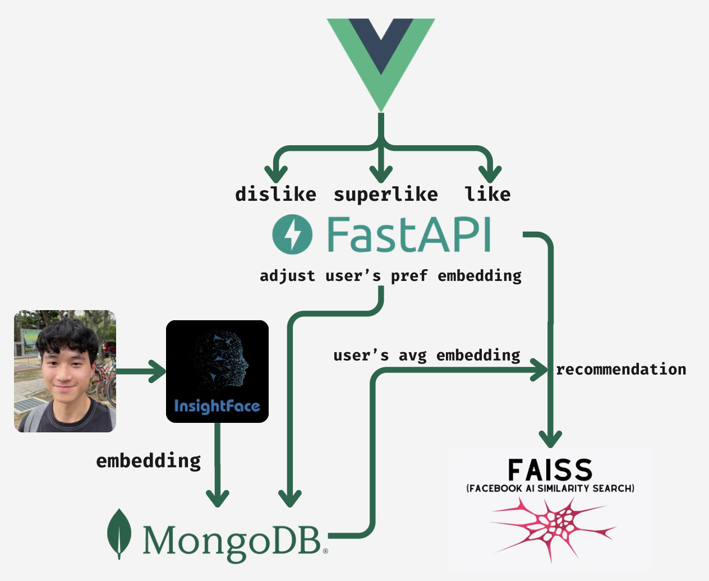

# ML Backend API

A FastAPI-based machine learning backend for photo recommendation using face recognition and FAISS vector similarity search.

## Features

- User authentication (registration/login)
- Face detection and embedding extraction with gender detection
- Personalized photo recommendations using FAISS similarity search
- Swipe-based preference learning (like/pass/super_like)
- Dynamic learning rate that adapts based on user interaction history
- Negative feedback learning from passed photos
- Super like feature with stronger preference weighting
- Smart filtering to avoid showing previously swiped photos
- Gender-based photo filtering
- Batch photo processing with automatic face detection
- User preference management (view and clear preferences)

## Project Structure

```
Backend/
├── app/
│   ├── api/
│   │   ├── routes.py         # API route definitions
│   │   └── __init__.py
│   ├── core/
│   │   ├── config.py         # Settings and environment variables
│   │   ├── database.py       # MongoDB connection
│   │   ├── security.py       # Password hashing utilities
│   │   └── __init__.py
│   ├── models/
│   │   ├── schemas.py        # Pydantic models
│   │   └── __init__.py
│   ├── services/
│   │   ├── face_recognition.py   # Face detection service
│   │   ├── faiss_service.py      # FAISS indexing
│   │   ├── user_service.py       # User management
│   │   ├── photo_service.py      # Photo operations
│   │   ├── swipe_service.py      # Swipe handling
│   │   └── __init__.py
│   ├── utils/
│   │   ├── search.py         # Search utilities
│   │   └── __init__.py
│   ├── main.py               # Application entry point
│   └── __init__.py
├── .env.example              # Example environment variables
├── .gitignore                # Git ignore rules
├── pyproject.toml            # Project configuration
├── requirements.txt          # Python dependencies
└── README.md                 # This file
```

## Installation

### Prerequisites

- Python 3.10+
- MongoDB
- pip

### Setup

1. Clone the repository:
```bash
git clone <repository-url>
cd Backend
```

2. Create and activate a virtual environment:
```bash
python -m venv venv

# Windows
venv\Scripts\activate

# Linux/Mac
source venv/bin/activate
```

3. Install dependencies:
```bash
pip install -r requirements.txt
```

4. Configure environment variables:
```bash
cp .env.example .env
# Edit .env with your MongoDB URI and settings
```

5. Run the application:
```bash
uvicorn app.main:app --reload --host 0.0.0.0 --port 8010
```

## Environment Variables

Create a `.env` file with the following variables:

```env
# Required
MONGO_URI=mongodb://localhost:27017

# Optional (defaults shown)
MONGO_DB_NAME=ml
APP_NAME=ML Backend API
DEBUG=false
FAISS_DIMENSION=512
FAISS_RECOMMENDATIONS_COUNT=10

# Recommendation Algorithm Settings
NEGATIVE_FEEDBACK_WEIGHT=0.02
SUPER_LIKE_WEIGHT_MULTIPLIER=3.0

# Dynamic Learning Rate Settings
EARLY_LEARNING_DECAY_MIN=0.5
EARLY_LEARNING_DECAY_MAX=0.7
MID_LEARNING_DECAY=0.9
EARLY_LEARNING_THRESHOLD=10
STABLE_LEARNING_THRESHOLD=50
```

## API Endpoints

### Authentication

#### `POST /register`
Register a new user account.

**Request Body:**
```json
{
  "username": "string (min 3 characters)",
  "password": "string (min 6 characters)"
}
```

**Response:**
```json
{
  "msg": "User registered"
}
```

**Error Cases:**
- `400 Bad Request` - User already exists
- `422 Unprocessable Entity` - Invalid request body

---

#### `POST /login`
Authenticate an existing user.

**Request Body:**
```json
{
  "username": "string",
  "password": "string"
}
```

**Response:**
```json
{
  "msg": "Login successful"
}
```

**Error Cases:**
- `400 Bad Request` - Invalid credentials

---

### User Management

#### `GET /users/{username}/recommendations`
Get personalized photo recommendations based on user's preference history.

**Path Parameters:**
- `username` - The username to get recommendations for

**Query Parameters:**
- `gender` (optional) - Filter by gender ('M' or 'F')

**Response (Personalized):**
```json
{
  "recommendations": [
    {
      "photo_id": "string",
      "filename": "string",
      "content_type": "string",
      "similarity": 0.95,
      "rank": 1
    }
  ],
  "recommendation_type": "personalized",
  "based_on_embeddings": 15
}
```

**Response (New User):**
```json
{
  "recommendations": [...],
  "recommendation_type": "new_user_neutral",
  "based_on_embeddings": 0
}
```

**Implementation Details:**
- Personalized users: FAISS similarity search using user's average embedding
- New users: Uses dataset average as neutral query vector
- Pre-filters photos at database level (gender, excluded photos)
- Automatically excludes photos the user has already swiped

---

#### `GET /users/{username}/embeddings`
Retrieve all face embeddings the user has liked.

**Response:**
```json
{
  "embeddings": [
    [0.123, -0.456, ...],
    [0.789, -0.321, ...]
  ]
}
```

---

#### `GET /users/{username}/avg_embedding`
Get the user's average face embedding (preference profile).

**Response:**
```json
{
  "avg_embedding": [0.123, -0.456, ...],
  "embedding_count": 15
}
```

---

#### `GET /users/{username}/swiped_photos`
Get all photos the user has swiped (both liked and disliked).

**Response:**
```json
{
  "liked_photos": ["photo_id_1", "photo_id_2"],
  "disliked_photos": ["photo_id_3", "photo_id_4"]
}
```

---

#### `DELETE /users/{username}/preferences`
Clear all user preferences including embeddings and swipe history.

**Response:**
```json
{
  "msg": "User preferences cleared successfully"
}
```

---

#### `POST /users/{username}/embeddings`
Manually add an embedding to a user's collection.

**Request Body:**
```json
{
  "embedding": [0.123, -0.456, ...]
}
```

**Response:**
```json
{
  "msg": "Embedding added"
}
```

---

#### `POST /users/{username}/search`
Search the user's liked photo embeddings using FAISS.

**Request Body:**
```json
{
  "query": [0.123, -0.456, ...]
}
```

**Response:**
```json
{
  "results": [
    {
      "embedding": [0.123, -0.456, ...],
      "similarity": 0.92,
      "rank": 1
    }
  ]
}
```

---

### Photos

#### `GET /photos/{photo_id}`
Retrieve a photo's binary data.

**Response:** Binary image data with appropriate content-type header.

---

#### `POST /photos/upload`
Upload a new photo to the database.

**Form Data:**
- `file` - Image file (required)
- `gender` - Gender classification: 'M' or 'F' (required)

**Response:**
```json
{
  "msg": "Photo uploaded successfully",
  "photo_id": "string",
  "face_detected": true,
  "gender": "M"
}
```

**Implementation Details:**
- Automatically extracts face embedding if face is detected
- Rebuilds FAISS index after successful upload
- Photos without faces are saved but won't appear in recommendations

---

### Interactions

#### `POST /swipe`
Process a user's swipe action on a photo.

**Request Body:**
```json
{
  "username": "string",
  "photo_id": "string",
  "action": "like" | "pass" | "super_like"
}
```

**Response (Like):**
```json
{
  "msg": "Like recorded and embedding updated",
  "embedding_updated": true,
  "face_detected": true,
  "embedding_count": 16
}
```

**Response (Super Like):**
```json
{
  "msg": "Super like recorded and embedding updated with stronger weight",
  "embedding_updated": true,
  "face_detected": true,
  "embedding_count": 16,
  "super_like": true
}
```

**Response (Pass):**
```json
{
  "msg": "Pass recorded with negative feedback",
  "embedding_updated": true,
  "negative_feedback_applied": true
}
```

**Implementation Details:**
- `like`: Updates user's average embedding with dynamic learning rate
- `super_like`: Updates with 3x stronger weight (configurable)
- `pass`: Applies negative feedback, pushing preferences away from the photo

---

### Admin

#### `POST /admin/process_embeddings`
Process all photos in the database and extract face embeddings.

**Query Parameters:**
- `force` (optional, default: false) - Re-process all photos

**Response:**
```json
{
  "msg": "Photo embedding processing completed",
  "total_photos": 1523,
  "photos_processed": 245,
  "photos_with_embeddings": 1400,
  "no_face_detected": 45,
  "photos_deleted": 45,
  "remaining_photos": 1478,
  "failed": 0
}
```

**Implementation Details:**
- Photos without detected faces are automatically deleted
- Call `/admin/rebuild_index` after processing to update FAISS index

---

#### `POST /admin/rebuild_index`
Rebuild the FAISS similarity search index.

**Response:**
```json
{
  "msg": "FAISS index rebuilt successfully",
  "total_photos": 1523
}
```

---

#### `GET /admin/index_status`
Get the current status of the FAISS index.

**Response:**
```json
{
  "index_initialized": true,
  "total_photos_indexed": 1523,
  "index_dimension": 512
}
```

---

#### `GET /admin/debug/{username}`
Debug endpoint to inspect user's swipe history and FAISS index state.

**Response:**
```json
{
  "liked_photos": ["photo_id_1", "photo_id_2"],
  "liked_types": ["str", "str"],
  "disliked_photos": ["photo_id_3"],
  "disliked_types": ["str"],
  "faiss_photo_ids_sample": ["photo_id_5", "photo_id_6"],
  "faiss_types": ["str", "str"]
}
```

---

### Health

#### `GET /`
Basic health check endpoint.

**Response:**
```json
{
  "status": "ok",
  "app": "ML Backend API"
}
```

---

#### `GET /health`
Detailed health check including service status.

**Response:**
```json
{
  "status": "healthy",
  "faiss_index": {
    "index_initialized": true,
    "total_photos_indexed": 1523,
    "index_dimension": 512
  }
}
```

## Architecture



### Key Components

1. **Face Recognition Service**: Uses InsightFace for face detection and 512-dimensional embedding extraction with gender detection
2. **FAISS Service**: Manages vector similarity search index using IndexFlatIP (inner product)
3. **User Service**: Handles user registration, authentication, and preference management with dynamic learning rates
4. **Photo Service**: Manages photo storage, retrieval, and recommendations
5. **Swipe Service**: Processes user interactions and updates preferences

### Dynamic Learning Rate

The system adapts its learning rate based on user interaction history:

- **Early stage (0-10 likes)**: Fast learning with decay 0.5-0.7
- **Mid stage (10-50 likes)**: Gradual stabilization with decay up to 0.9
- **Stable stage (50+ likes)**: High stability with decay 0.9

This ensures:
- New users' preferences are established quickly
- Established users' preferences remain stable
- Preferences can still adapt over time

## MongoDB Schema

### users collection
```javascript
{
  "_id": ObjectId,
  "username": string,
  "hashed_password": string,
  "embeddings": [[float]],        // All liked photo embeddings
  "avg_embedding": [float] | null, // Running average (512-dim)
  "embedding_count": int,          // Number of likes
  "liked_photos": [string],        // Photo IDs user has liked
  "disliked_photos": [string]      // Photo IDs user has passed
}
```

### photos collection
```javascript
{
  "_id": ObjectId,
  "filename": string,
  "content_type": string,
  "data": Binary,              // Binary image data
  "embedding": [float] | null, // 512-dim face embedding
  "gender": string             // 'M' or 'F'
}
```

## Technologies

- **FastAPI**: Modern, fast web framework
- **MongoDB**: Document database for user and photo data
- **InsightFace**: State-of-the-art face recognition (ArcFace model)
- **FAISS**: Fast similarity search library by Meta
- **OpenCV**: Image processing
- **Pydantic**: Data validation
- **Passlib**: Password hashing